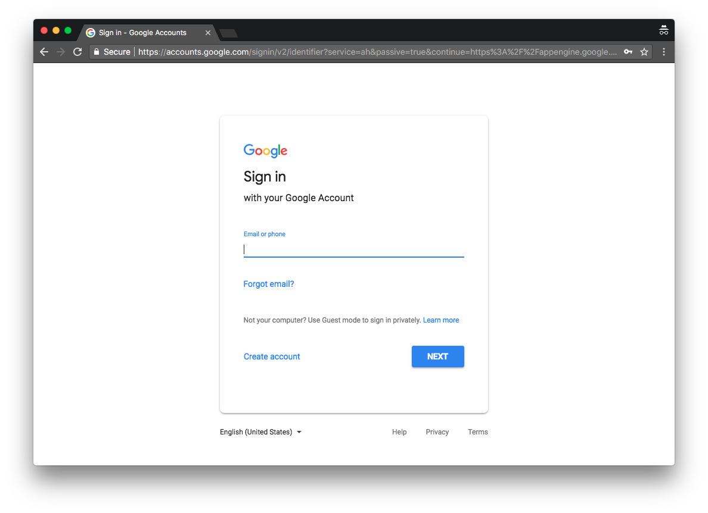
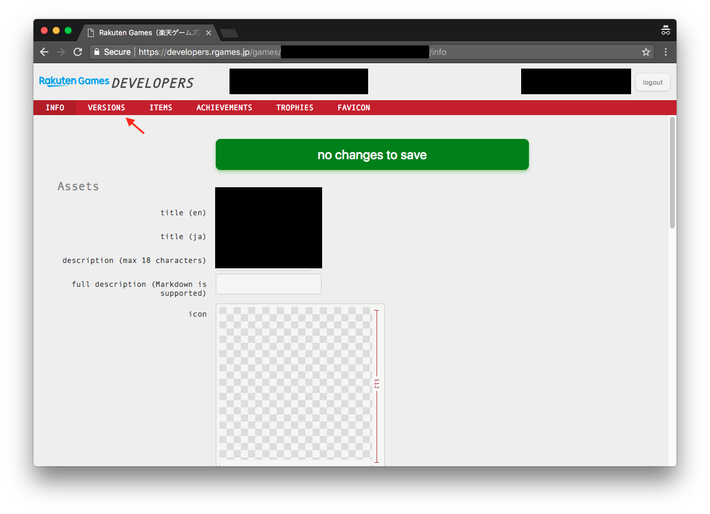
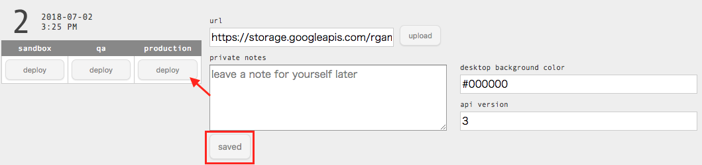
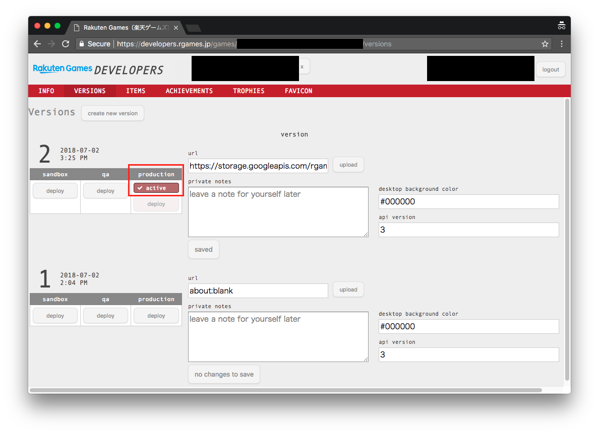
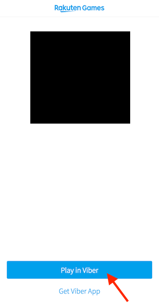
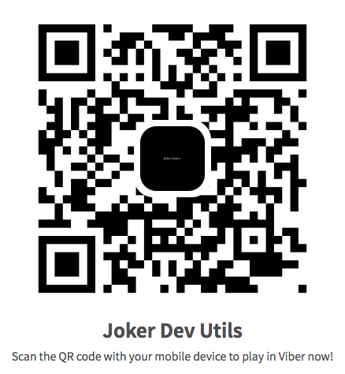
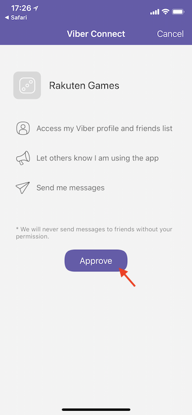
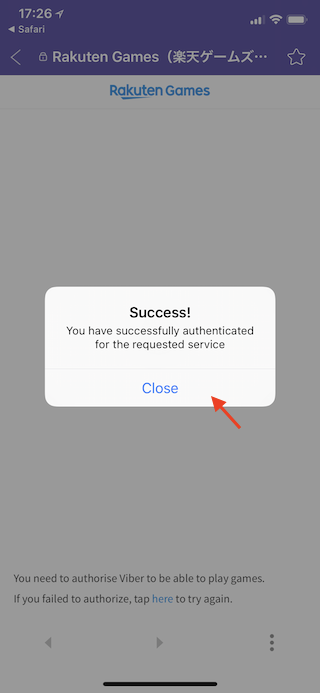
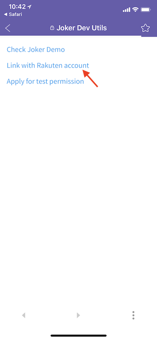
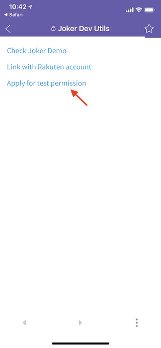

# Getting started with Viber Play SDK

[TOC]

## Development prerequisites

Information will be asked for the first time when developing games on Viber:

1. The name of the game
2. The name of the orgnization

We will give you back these information:

1. An organization account (suffixed with @rgames.jp)
2. A URL to the game's developer tool, like `https://developers.rgames.jp/games/{{GAME_ID}}/info`
3. A URL to test the game, like `https://rgames.jp/viber-game/{{GAME_NAME}}`
4. An APIKEY for Viber Play HTTP API authentication
5. An app secret to decipher signatured info

These will be used when you deploy the game to the portal.

## Regarding experimental features

As a envolving platform, we keep working on new features. To get quick feedbacks from the developer community, we'll even give developer with access to experimental features. You can find information about new expeirmental features in our Github release note, and also check if an API is marked as expeirmental or not in the API documentation of that version (starting from `v4.11.0`).

Please keep in mind that an experimental APIs are not promised to be align with the semantic version updates. Its behavior is only tested and up-to-date in the latest version, and it doesn't promise any level of availability.

## Install Viber Play SDK to your game

If you don't have a game, you can grab a example Viber Play game from https://github.com/rakuten-games/joker/tree/develop/examples/joker-demo and jump to the next section.

If you already have a gaming runnable on Facebook Instant Games. The following steps will show you how to make your game work with Viber Play.

### Step 1 Removing FBInstant SDK

FBInstant SDK won't be used in your Viber build for the game. Please make sure it's removed index.html. The tag usually looks like this:

```diff
- <script src="https://connect.facebook.net/en_US/fbinstant.x.x.js"></script>
```

### Step 2 Install Viber Play SDK

Viber Play SDK is the interface for game developers to inter\act with platform features on Viber. Insert it before any game script.

```diff
+ <script src="https://cdn.rgames.jp/static/libs/viber-play-sdk/x.x/bundle.js"></script>
  <script src="{{YOUR_GAME_SCRIPT}}"></script>
```

### Step 3 Replace all `FBInstant` reference to `ViberPlay`

In your game code, please replace all FBInstant reference to ViberPlay. Most of the APIs are identical.

```diff
- FBInstant.intializeAsync().then(() => {
+ ViberPlay.intializeAsync().then(() => {
    // Doing stuff
  });
```

```diff
- FBInstant.updateAsync(updatePayload).then(() => {
+ ViberPlay.updateAsync(updatePayload).then(() => {
-   FBInstant.quit();
+   ViberPlay.quit();
  });
```

## Deploy your game to Viber

The following steps will show you how to deploy a game to Viber:

### Step 1 Build your game and bundle it into a zip file

Make sure the zip file has a `index.html` file located at it's root path, otherwise it will not pass the upload check. Here's an example of file hierarchy:

```
.
├── index.html
├── script.js
├── style.css
├── libs
│   └── ...
└── assets
     └── ...
```

### Step 2 Upload the zip file

Use the `https://api.rgames.jp/joker/developers/game/upload` API to upload your game. Here's a example request:

```shell
curl -X POST \
  https://api.rgames.jp/joker/developers/game/upload \
  -H 'APIKEY: {{APIKEY}}' \
  -F game_id={{GAME_ID}} \
  -F asset=@{{PATH_TO_YOUR_GAME_BUNDLE}}.zip \
  -F 'comment={{SOME_COMMENT}}' \
  -F type=BUNDLE
```

### Step 2 Open the game's developer tool

Please open the URL provided. It usually looks like `https://developers.rgames.jp/games/{{GAME_ID}}/info` .

### Step 3 Login with the organization account

If you haven't logged in yet, you'll see a Google authorization prompt. Use the organization account provided to log in.

### Step 4 Go to VERSIONS tab



### Step 5 Activate the version

1. Find the latest version you've uploaded, click production **deploy** to activate this version
   
2. If an **active** is shown under the production column, you can move to the next section
   

## Test your game in Viber

You can test your game in Viber with the test URL, which usually looks like `https://rgames.jp/viber-game/{{GAME_NAME}}-test` . Tap **Play in Viber** to test the game.



_If opened in a desktop browser, it will show you a QR code, which can be scanned by a smart phone._

## (Experimental) Debug your game in desktop browser

Debugging stuff inside a WebView can be a pain, which lacks a proper devtool. We provide an alternative way to debug your game inside a desktop browser.

### Prerequisites

1. A game name, referred as `GAME_NAME` below, which can be extracted from the test URL
2. A Rakuten account, can be create at <https://grp01.id.rakuten.co.jp/rms/nid/registfwd?service_id=top>

### Step 1 Get a test account

If you happen to have a test account already, jump to the next step.

1. On a smart phone, use the QR below to open Viber Playr Dev Utils](https://rgames.jp/viber-game/joker-dev-utils) , and play in Viber.
   
2. (If it's your first time play a game) You'll be shown with a consent screen, tap **Agree** to proceed.
   
3. If you see a successful message, close the prompt to proceed.
   
4. Open [Viber Play Dev Utils](https://rgames.jp/viber-game/joker-dev-utils) again, tap **Link with Rakuten account** and login with your Rakuten account.
   
5. Tap **Apply for test permission** and send the email with required info.
   
6. Once the application is accepted, you'll receive a email reply, then you can proceed to the next step.

### Step 2 Login to [rgames.jp](https://rgames.jp)

On a desktop browser, go to <https://rgames.jp/api/auth/login?redirect=https%3A%2F%2Frgames.jp%2F> and log in with the Rakuten account you've linked

### Step 3 Start debugging

Once you're logged in, you can start debugging your game in a desktop browser, at this URL: `https://rgames.jp/play/{{GAME_NAME}}-test?platform=viber`

### Step 4 Debug against a game hosted at `localhost`

You can also debug a game hosted at localhost by appending a `gameUrl` param to the URL, such as: `https://rgames.jp/play/{{GAME_NAME}}-test?platform=viber&gameUrl=https://localhost:8080/index.html`

_`gameUrl` only accepts a URL from `https://localhost` domain._

_If you find the game is not loading, possibility is that the SSL for localhost is not trusted. If you're using Chrome, try enabling <chrome://flags/#allow-insecure-localhost> ._

## Accessing Viber Play HTTP API

Chatbot, admin features will be avaialbe for game server from Viber Play HTTP API. API explorer/documentation can be found at <https://demo.rgames.jp/joker-swagger-ui/> .

### Prerequisite

1. A working Viber Play game on Viber
2. An APIKEY for Viber Play HTTP API authentication

Please ask <partners@rgames.jp> if you need help with getting it.

### Note

Viber Play HTTP API is supposed to be only consumed by game server. Please never use it in a game client, which may result in leaking your APIKEY.

## Questions?

If you have any question, please feel free to contact <partners@rgames.jp> .
